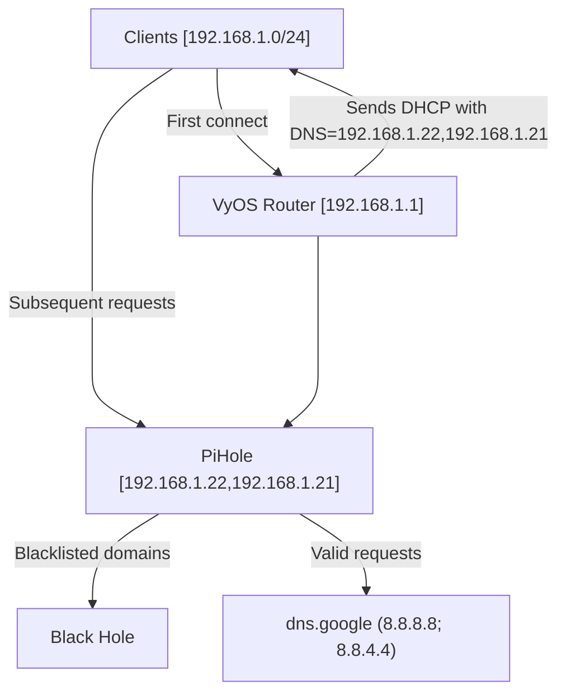

Clients connecting to the local network for the first time will receive as part of the DHCP negotiation ([code 6](https://en.wikipedia.org/wiki/Dynamic_Host_Configuration_Protocol#Information)) the domain name servers' addresses. These addresses will correspond to the IP addresses of the PiHole servers (currently RasPis at `192.168.1.22` and `192.168.1.21`). 
From that point, clients will send simultaneous DNS requests to both Piholes and use the first response received. This means the PiHoles will be able to track requests per-client. However, this splits tracking data between the two servers, so it may be difficult to visualize a complete picture. 
A client can be manually configured to request DNS resolution from the router, which will forward requests to the PiHoles.
DNS requests to the PiHole will be checked against the [configured adlists](https://pihole.jafner.net/groups-adlists.php). If matched, the request will be blocked. If a user is attempting to access a website that is blocked, the request should quickly resolve to a Domain Not Found error. It will look like this:

If the request does not match any adlists, it will be passed upstream to Google `8.8.8.8` (or backup `8.8.4.4`). 
Presently, the PiHole does not cache any requests. 
