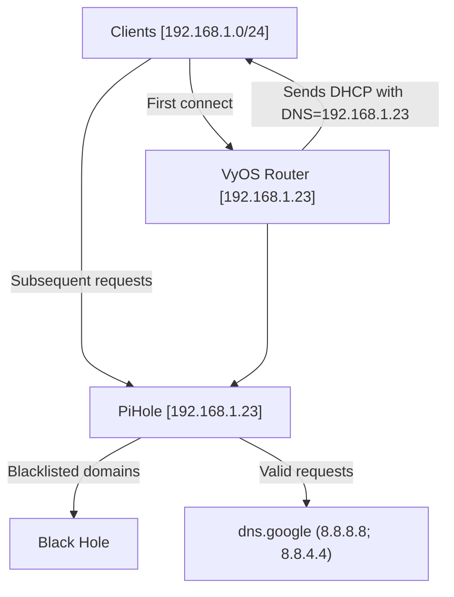

Clients connecting to the local network for the first time will receive as part of the DHCP negotiation ([code 6](https://en.wikipedia.org/wiki/Dynamic_Host_Configuration_Protocol#Information)) the domain name server's address. This address will correspond to the IP address of the PiHole server (currently a RasPi at `192.168.1.23`). 
From that point, the client's DNS requests will go directly to the PiHole on an IP level. This means the PiHole will be able to track requests per-client. 
However, a client can be manually configured to request DNS resolution from the router, which will forward requests to the PiHole.
DNS requests to the PiHole will be checked against the [configured adlists](https://pihole.jafner.net/groups-adlists.php). If matched, the request will be blocked. If a user is attempting to access a website that is blocked, the request should quickly resolve to a Domain Not Found error. It will look like this:

[Chrome](/docs/img/pihole_domain_blocked_chrome.png)
[Firefox](/docs/img/pihole_domain_blocked_firefox.png)

If the request does not match any adlists, it will be passed upstream to Google `8.8.8.8` (or backup `8.8.4.4`). 
Presently, the PiHole does not cache any requests. 
