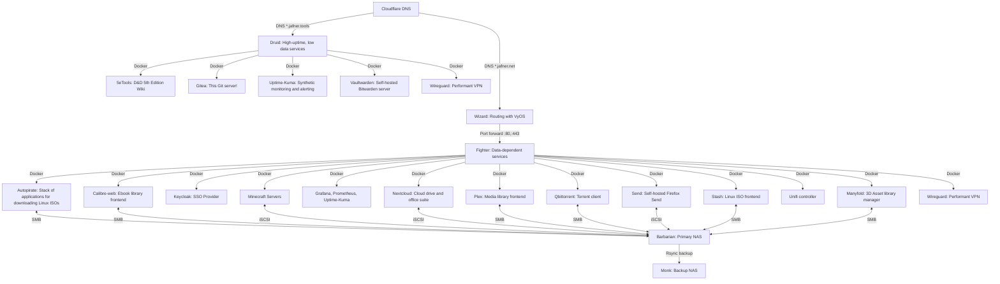

```mermaid
flowchart TD
    barbarian
    druid
    fighter
    monk
    wizard
    cloudflare

cloudflare["Cloudflare DNS"] --DNS *.jafner.tools--> druid["Druid: High-uptime, low data services"]
cloudflare --DNS *.jafner.net----> wizard["Wizard: Routing with VyOS"]
wizard --Port forward :80,:443--> fighter["Fighter: Data-dependent services"]
barbarian["Barbarian: Primary NAS"] --Rsync backup--> monk["Monk: Backup NAS"]

druid --Docker--> 5eTools["5eTools: D&D 5th Edition Wiki"]
druid --Docker--> Gitea["Gitea: This Git server!"]
druid --Docker--> Uptime-Kuma["Uptime-Kuma: Synthetic monitoring and alerting"]
druid --Docker--> Vaultwarden["Vaultwarden: Self-hosted Bitwarden server"]
druid --Docker--> Wireguard["Wireguard: Performant VPN"]

fighter --Docker--> Autopirate["Autopirate: Stack of applications for downloading Linux ISOs"] <--SMB--> barbarian
fighter --Docker--> Calibre-web["Calibre-web: Ebook library frontend"] <--SMB--> barbarian
fighter --Docker--> Keycloak["Keycloak: SSO Provider"] 
fighter --Docker--> Minecraft["Minecraft Servers"] <--iSCSI--> barbarian
fighter --Docker--> Grafana["Grafana, Prometheus, Uptime-Kuma"]
fighter --Docker--> Nextcloud["Nextcloud: Cloud drive and office suite"] <--iSCSI--> barbarian
fighter --Docker--> Plex["Plex: Media library frontend"] <--SMB--> barbarian
fighter --Docker--> Qbittorrent["Qbittorrent: Torrent client"] <--SMB--> barbarian
fighter --Docker--> Send["Send: Self-hosted Firefox Send"] <--iSCSI--> barbarian
fighter --Docker--> Stash["Stash: Linux ISO frontend"] <--SMB--> barbarian
fighter --Docker--> Unifi["Unifi controller"]
fighter --Docker--> Vandam["Manyfold: 3D Asset library manager"] <--SMB--> barbarian
fighter --Docker--> Wireguard2["Wireguard: Performant VPN"]
```
