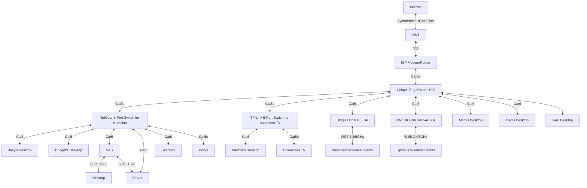

```mermaid
flowchart TD;
	Internet<--Symmetrical 1Gbit Fiber-->ONT;
		ONT<--???-->Modem[ISP Modem/Router];
			Modem<--Cat5e-->Router[Ubiquiti EdgeRouter 10X];
				Router<--Cat5e-->switch_homelab[NetGear 8-Port Switch for Homelab];
					switch_homelab<--Cat6-->desktop_joey[Joey's Desktop];
					switch_homelab<--Cat5-->desktop_bridget[Bridget's Desktop];
					switch_homelab<--Cat6-->NAS;
						NAS<--SFP+ DAC-->Desktop;
						NAS<--SFP+ DAC-->Server;
					switch_homelab<--Cat6-->Server;
					switch_homelab<--Cat6-->Seedbox;
					switch_homelab<--Cat5e-->Pihole;
				Router<--Cat5e-->switch_basementtv[TP-Link 5-Port Switch for Basement TV];
					switch_basementtv<--Cat6-->desktop_maddie[Maddie's Desktop];
					switch_basementtv<--Cat5e-->client_tv_downstairs[Downstairs TV];
				Router<--Cat6-->wap_basement[Ubiquiti Unifi U6-Lite];
					wap_basement<--Wifi6 2.4/5GHz-->clients_wireless_basement[Basement Wireless Clients];
				Router<--Cat6-->wap_upstairs[Ubiquiti Unifi UAP-AC-LR];
					wap_upstairs<--Wifi5 2.4/5GHz-->clients_wireless_upstairs[Upstairs Wireless Clients];
				Router<--Cat6-->desktop_mom[Mom's Desktop];
				Router<--Cat6-->desktop_dad[Dad's Desktop];
				Router<-->desktop_gus[Gus' Desktop];	
```
