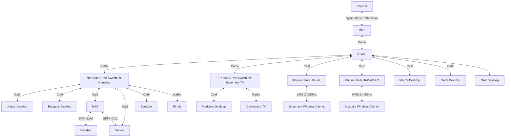

# Full Network Diagram

# Router Interfaces
| Interface | Connected to |
|:---------:|:------------:|
| `eth0` | (Upstream) Zyxel C3000Z modem | 
| `eth1` | Reserved for `192.168.2.1/24` |
| `eth2` | Homelab switch |
| `eth3` | Mom's office PC |
| `eth4` | Gus' PC |
| `eth5` | (Disconnected) Outlets behind upstairs couch |
| `eth6` | Maddie's office switch |
| `eth7` | Dad's office PC |
| `eth8` | (PoE, injected) Upstairs wireless AP |
| `eth9` | (PoE, native) Homelab wireless AP |
| `pppoe0` | PPPoE layer pysically on `eth0` |
| `switch0` | Internal router switch |