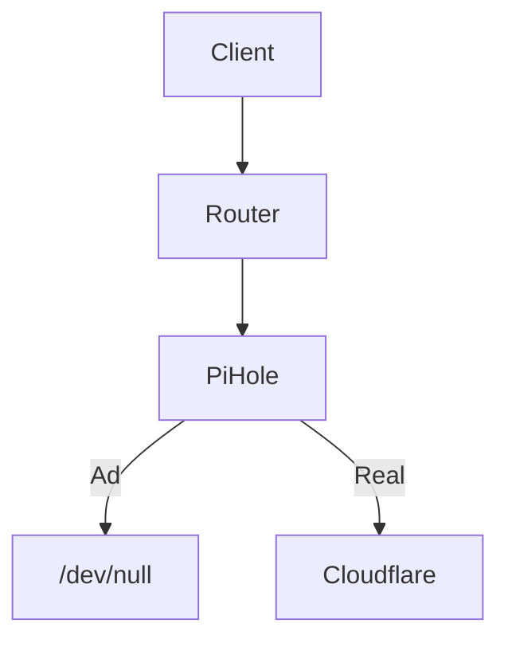

# Port Forwarding Rules
| Rule | Incoming Port | Protocol | Docs |
|:----:|:-------------:|:--------:|:----:|
| Plex | 32400 | Both | [support.plex.tv](https://support.plex.tv/articles/201543147-what-network-ports-do-i-need-to-allow-through-my-firewall/)
| BitTorrent | 51000-51999 | Both | [wikipedia.org](https://en.wikipedia.org/wiki/BitTorrent)
| WireGuard | 53820 | Both | [wireguard.com](https://www.wireguard.com/quickstart/)
| Minecraft | 25565 | Both | [portforward.com](https://portforward.com/minecraft/)
| Iperf | 50201 | Both | [iperf.fr](https://iperf.fr/iperf-doc.php)
| http/s | 80,443 | Both | [wikipedia.org](https://en.wikipedia.org/wiki/Hypertext_Transfer_Protocol)
| Peertube Live | 1935 | Both | [joinpeertube.org](https://docs.joinpeertube.org/admin-configuration?id=live-streaming)
| Git SSH | 2228-2229 | Both | [gitlab.com](https://docs.gitlab.com/ee/install/docker.html)

## Non-Default Port Mappings
Some services have been configured to use non-standard port mappings. This is usually done to mitigate the risk of automated port-checking probes.

* BitTorrent. This range is used to distribute all bittorrent connections across a wide range of high-number ports. See [deluge configuration](../seedbox/config/deluge) for more information about what port ranges go to which torrent clients.
* Wireguard. This was set to a non-standard port-mapping before I learned [WireGuard doesn't respond to unauthenticated packets](https://news.ycombinator.com/item?id=24550238), which makes this unnecessary.
* Iperf. Iperf defaults to port 5201, which is not a high-number port. Since it is unauthenticated, I use a non-default, high-number port instead.
* Git SSH. I use a non-default port for my GitLab SSH server to minimize potential conflicts with other services on the network. It is important to be able to access the GitLab instance over SSH outside the network.

# DNS Resolution Structure


# DHCP Configuration Parameters
| Parameter | Value |
|:-:|:-:|
| DHCP Name | LAN1 |
| Subnet | 192.168.1.0/24 |
| Lease Pool | 192.168.1.100-254/24 |
| Router | 192.168.1.1 |
| DNS1 | 192.168.1.1 |
| DNS2 | - |
| Domain | local |
| Lease TTL | 86400 seconds |

## Static DHCP Mappings
| Host | IP Address |
|:----:|:----------:|
| joey-nas | 192.168.1.10 |
| joey-seedbox | 192.168.1.21 |
| joey-server | 192.168.1.23 |
| pihole | 192.168.1.22 |

# CLI Reference
* [EdgeOS User Guide PDF](https://dl.ubnt.com/guides/edgemax/EdgeOS_UG.pdf)
* EdgeOS is built on [Vyatta](https://en.wikipedia.org/wiki/Vyatta)
* To make configuration changes in the CLI, run `configure`, make the changes (e.g. `set interfaces ethernet eth0 dhcpv6-pd pd 0 interface eth1`), then save the changes with `commit; save; exit`.

## Configure SSH Keys
Via: https://thehomeofthefuture.com/how-to/use-an-ssh-key-with-an-ubiquiti-edgerouter/

### Via WebUI
1. Navigate to the Config Tree
2. Dig down to `system / login / user / admin / authentication / public-keys /`
3. Add a new "public-keys" value with the name of the key.
4. Refresh the tree and open the newly-created sub-directory named after the key.
5. Add the key information here. Leave "options" empty. Omit `ssh-rsa` and the comment from the key, place the type in the "type" field.
6. Click "Preview" then "Apply"

### Via SSH
1. SSH into system
2. `configure`
3. 
```sh
set system login user admin authentication public-keys jafner425@gmail.com
set system login user admin authentication public-keys jafner425@gmail.com type ssh-rsa
set system login user admin authentication public-keys jafner425@gmail.com key $KEY_VALUE
```
4. `commit; save; exit`

# Check Traffic by TCP Connection
To get a monitoring panel of bandwidth usage listed by connection on the internet, use `sudo iftop -i pppoe1`.
To instead get usage listed by connection on LAN, use `sudo iftop -p -i eth6`

[`iftop` docs](https://linux.die.net/man/8/iftop). Use [`pcap-filter'](https://www.tcpdump.org/manpages/pcap-filter.7.html) syntax for filtering with the `-f` flag.