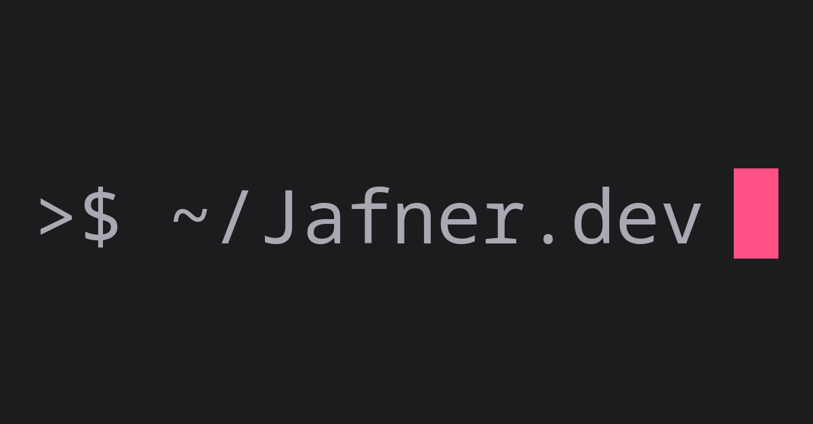

# Running local dev server
1. Ensure theme submodule is loaded: `git submodule init && git submodule update`
2. Run the server with `hugo server --noHTTPCache --ignoreCache --disableFastRender --buildDrafts`

## Including Images in Content
*Good old-fashioned markdown image embedding works just fine.*

1. Place the image file beside the content in the folder (called a ["page bundle"](https://gohugo.io/content-management/page-bundles/)).
2. For a Featured Image, use the line `featured_image = "image.jpg"` in the frontmatter.
3. For an inline image, use ``

> Note: The working directory for relative resource locations uses the name of the content file as the current location. E.g. referencing the image `./myimage.jpg` or `./myimage.jpg` from inside the `/content/projects/myproject.md` content file, would look for those images at `/content/projects/myproject/myimage.jpg`.

## Add a Table of Contents
- To include a table of contents at the beginning of a page, add the flag `toc = true` to the frontmatter.
- To insert a table of contents inline with the text, use the `{}` shortcode.
- Tables of contents are configured under the `[markup]` configuration node in [`config.toml`](config.toml).

## Create a New Homelab or Project Article
Use hugo's `hugo new content` command with the path (relative to root) to the content page for the new article.

Examples:
- `hugo new content content/projects/my-new-project.md` This will create a new draft page with the title and date set smartly, as well as `draft = true`
- `hugo new content content/projects/my-new-project/index.md` This will create a new draft page inside a page bundle, creating the bundle directory if needed.

## Set non-default `og:image` image for embedders
To set the image that is used when other sites or services embed a link (e.g. Discord), we use the `ogimage` page param in the frontmatter. The value is the path to the desired image relative to the `static` directory.

Examples:
- Unset `ogimage` tag will fall back to [`/static/img/logo.png`](static/img/Jafner.dev.logo.png).
- `ogimage = 'img/mobilebanner.png'` will use `/static/img/mobilebanner.png`.

This is separate from any image content visible on the site itself, which makes it useful for preserving the cleanliness of the reading experience.

## Generate article images with ImageMagick
Assign the text to use for the article image to the `LOGOTEXT` variable. E.g. `LOGOTEXT="Jafner.dev"`

```bash
LOGOTEXT="Jafner.dev"
convert -size 1200x630 xc:#1b1c1d -pointsize 110 -font "Noto-Sans-Mono-Regular" \
   -fill #A9A9B3 -draw "text 50,360 '>$ ~/$LOGOTEXT'"\
   -fill #FE5186 -gravity East -draw "text 50,0 '█'"\
   $LOGOTEXT.logo.png
```

And that will generate an image like:



It can be a little finicky to make the text *look right*, especially getting the left-right spacing down. Use the following parameters to make changes:

- `xc:#1b1c1d` sets the background color to the provided hex code.
- `-pointsize 128` sets the font size of the text.
- The first `-font @Inter.ttf` sets the font to [Inter](https://fonts.google.com/specimen/Inter), the preferred font for the site.
- The first `-fill #A9A9B3` sets the color for the text part of the logo.
- The first `-draw "text 50,360 '>$ ~/$LOGOTEXT'"` draws the `>$ ~/` part of the logo, then uses the `$LOGOTEXT` variable for the proceeding text. The `text 50,360` describes the X,Y offset in pixels from the top-left of the image to begin drawing the text.
- The second `-font "Noto-Sans-Mono-Regular"` sets the font we need to use for Unicode character support. See the list of available fonts with `convert -list font | less`. If we don't need the cursor block, this entire line can be omitted.
- The second `-fill #FE5186` sets the color of the [cursor block](https://www.compart.com/en/unicode/U+2588).
- `-gravity East` sets the draw orientation to the middle of the right side of the frame.
- The second `-draw "text 50,0 '█'"` draws the unicode cursor block character 50 pixels X-offset (from the middle-right)

Hex codes:
- Pink cursor block: #FE5186
- Dark grey header background: #1A1B1C
- Light grey header logo text: #A9A9B2

# Organizing Content
When creating new content, we gotta keep in mind a few of the systems that are dependent on organizational consistency.

1. Use `slug = 'mypage'` to set the name that will be used in the URL, and in the dynamic logo at the top-left.
   1. For `homelab` articles, this will be prepended with `/homelab/` already, so don't be redundant. E.g. don't use `slug = 'homelab-tour'`, use `slug = 'tour'`. The former will render as `/homelab/homelab-tour/` and the latter will render as `/homelab/tour/`
2. Isn't `/homelab/` a type of `/projects/` ? Yes. But it's such a huge project that it has earned its own category.
3. Titles should be either like `Homelab Tour: Reviewing the what, how, and why of my lab`, or `Esports-grade Overwatch 2 on Linux`. That is, either a very short title with an expounding subtitle, or a sufficiently self-descriptive title.
   1. Use a colon to separate subtitle.
