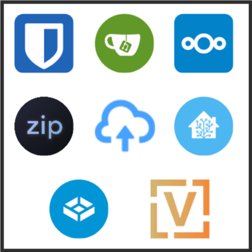

+++
title = 'Homelab Tour'
description = "In this article I walk through the services I run, what problems they solve for me, and the lessons I've learned."
date = 2024-06-27T09:15:13-07:00
aliases = ["/articles/homelab-tour-series-intro", "/homelab-tour"]
author = "Joey Hafner"
ogimage = 'Homelab.tour.logo.png'
slug = 'tour'
draft = false
+++

## There are many like it...

But this lab is built *by me and for me*. Just as I am the sole (or primary) beneficiary of its value, I am also the sole owner. I've gotta pay for all the hard drives, the network switches, the API keys, the power supplies, the rack rails. I've gotta configure the SMTP notifications, the [DNS](https://xkcd.com/2259/), the firewalls and the subnets. I open, update, and close issues, remediate leaked secrets, and write documentation.

It's exhausting and exhilarating, frustrating and fulfilling, thankless and thankful. And I've never written about it before, so here's me finally getting to do that.

{}

## Core Services: It's about data.
[For](https://www.npr.org/2021/04/09/986005820/after-data-breach-exposes-530-million-facebook-says-it-will-not-notify-users) [myriad](https://www.forbes.com/sites/quickerbettertech/2021/07/05/a-linkedin-breach-exposes-92-of-usersand-other-small-business-tech-news/) [reasons](https://www.theverge.com/2018/5/3/17316684/twitter-password-bug-security-flaw-exposed-change-now), [I want](https://www.techtarget.com/whatis/feature/SolarWinds-hack-explained-Everything-you-need-to-know) to [maintain](https://www.bbc.com/news/technology-37232635) as much [control](https://www.theverge.com/2022/12/22/23523322/lastpass-data-breach-cloud-encrypted-password-vault-hackers) of [my data](https://www.bbc.com/news/technology-58817658) [as possible](https://cloudsecurityalliance.org/blog/2022/03/13/an-analysis-of-the-2020-zoom-breach). So I got hard drives to store my data, and built computers around those hard drives to move my data to and fro. Lastly, I selected a few of the awesome projects others have built to tell the computers how to move my data.



Veteran self-hosters are familiar with many of these, but I want to talk about how each of these projects helps me claw back a little bit of control over my data.

### Bitwarden: The best password manager
*Password management server.* | [Bitwarden](https://bitwarden.com/) ([Vaultwarden](https://github.com/dani-garcia/vaultwarden)) | [`bitwarden.jafner.net`](https://bitwarden.jafner.net) |

I used to use LastPass.
- *June 15, 2015* [ArsTechnica: Hack of cloud-based LastPass exposes hashed master passwords](https://arstechnica.com/information-technology/2015/06/hack-of-cloud-based-lastpass-exposes-encrypted-master-passwords/)
- *December 28, 2021* [BleepingComputer: LastPass users warned their master passwords are compromised](https://www.bleepingcomputer.com/news/security/lastpass-users-warned-their-master-passwords-are-compromised/)
- *November 30, 2022* [BleepingComputer: Lastpass says hackers accessed customer data in new breach](https://www.bleepingcomputer.com/news/security/lastpass-says-hackers-accessed-customer-data-in-new-breach/)

Bitwarden has an [excellent security track record *so far*](https://bitwarden.com/blog/third-party-security-audit/). But two factors (ha!) led to my choosing to self-host the community-built server instead of using Bitwarden's first-party cloud service:

1. Subscription-gated features. 2FA/OTP authenticator, file attachments, security reports, and more are gated behind a subscription. I wholeheartedly endorse Bitwarden's decision, but that's just enough encouragement for me to host it myself.
2. Bigger means more attractive target. The more people put their trust in Bitwarden, the more attractive a target it becomes. My personal server is unlikely to attract the attention of any individuals or organizations with the capability to penetrate *Bitwarden's* security. Of course, that only matters if I maintain good security posture everywhere else in the homelab. More on that another day.

I've had an excellent experience with Bitwarden so far. The user experience is fluid enough that I was able to onboard my family without issue.

### Send: The service formerly known as Firefox Send
*Quick and secure file share. [XKCD#949](https://xkcd.com/949/).* | [Send](https://github.com/timvisee/send) | [`send.jafner.net`](https://send.jafner.net/)

The XKCD comic above articulates and experience I've had enough times. Nextcloud helps a lot when I want to share a file with someone else. But Send covers the cases where a friend wants to send me a file, or a friend is asking me how to send a file to another friend. I can just send them the link. I don't even need to explain how it works, it's built intuitively enough. And I get some peace of mind knowing that the files are encrypted end-to-end.

### Zipline: Clip that
*Media sharing server (upload screenshots, recordings).* | [Zipline](https://github.com/diced/zipline) | [`zipline.jafner.net`](https://zipline.jafner.net)

This service exists exclusively to let me right click the video file of a gaming highlight, hit "Share", and send the link to my friends as seamlessly as possible *while supporting high-fidelity content*. I record my gameplay at 1440p 120 FPS. Check it out:

- [Venture 5k](https://zipline.jafner.net/u/%5B2024-06-19%5D%20Neato.mp4).
- [Venture scrim highlight](https://zipline.jafner.net/u/%5B2024-05-22%5D%20Venture%20Clutch.mp4)
- [My greatest widowmaker highlight](https://zipline.jafner.net/u/%5B2023-04-10%5D%20Sombra's%20Here.mp4)

That last one's not even 120 fps, I just love to show it. To be honest though, if Youtube supported scripted/automated uploads I would just use that. But it's probably for the best that they don't.

### Home Assistant: Climate control for the Critter Cove
*Home automation and monitoring.* | [Home Assistant](https://www.home-assistant.io/) | [`homeassistant.jafner.net`](https://homeassistant.jafner.net)

I think a lot of folks start their self-hosting journey with Home Assistant. It's a fantastic tool, and it keeps some of your most important data from being reliant on [often-flakey vendors](https://gizmodo.com/the-never-ending-death-of-smart-home-gadgets-1842456125) who have little interest in supporting their product unless you're giving them money for it.

My partner and I have four reptiles, several insects, and a hamster whose climates I simply cannot be bothered to adjust manually every hour of the waking day. So I installed Home Assistant, hooked up warm-side and cool-side [Govee hygrometer/thermometers](https://us.govee.com/products/govee-bluetooth-hygrometer-thermometer-h5075?Style=1*H5075), put the heating lamps on [TP Link smart dimming plugs](https://www.kasasmart.com/us/products/smart-plugs/product-kp405), and wrote some automation to keep everybody in their happy temperature range.

### VyOS: My router is a text file
*Configuration-as-code router OS.* | [VyOS](https://vyos.io/)

One day I thought to myself, "do I know how a router works?" The answer was no, so I built one (hardware and configuration) from scratch between the hours of 10 PM and 4 AM to ensure none of my housemates would be disturbed by the requisite internet outage. I deployed the seat-of-my-pants router configuration to "production" overnight and handled about one day's worth of post-deployment support before everything was seamlessly stable.

The hardest part was crimping and terminating every single ethernet cable. At least 20 connections. Woof.

### TrueNAS: How I sleep at night
*Data safety provider.* | [TrueNAS](https://www.truenas.com/truenas-scale/)

Underpinning every single one of the above services in one way or another is my TrueNAS deployment. It is composed of two hosts: a primary and a backup. Every day, each system takes a [differential snapshot](https://www.truenas.com/docs/scale/24.04/scaleuireference/dataprotection/periodicsnapshottasksscreensscale/) of each dataset, and runs a short [S.M.A.R.T. test](https://www.truenas.com/docs/scale/24.04/scaleuireference/dataprotection/smarttestsscreensscale/) on each disk. Nightly, the most important datasets on the primary are backed up to the backup as an [Rsync task](https://www.truenas.com/docs/scale/24.04/scaleuireference/dataprotection/rsynctasksscreensscale/). And every week it runs a [scrub task](https://www.truenas.com/docs/scale/24.04/scaleuireference/dataprotection/scrubtasksscreensscale/) to ensure the stored data still checksums correctly.

And of course, it runs an SMB server and iSCSI target to facilitate clients and applications interacting with their own little data puddle.

## Additional Services: Just for fun
In addition to the important services above, I run a handful of services just for off time.

### Plex: I wish Jellyfin supported SSO
The superior media server, Plex provides a free (as in beer) solution with a beautiful frontend and comprehensive metadata scraping. Plex has set a standard for serving movies and TV that no alternative service has been able to match. It is the unwelcome incumbent no one has mustered the resources to dethrone. Over the last decade Plex has crept away from its [XBMC](https://en.wikipedia.org/wiki/Kodi_(software)) roots, and leaned into building services that make the business boys happy. They've been investing engineering hours into integrating more and more with external service providers, rather than [updating some of the core functionality](https://www.plexopedia.com/plex-media-server/general/metadata-stored/). And in [2022](https://www.theverge.com/2022/8/24/23319570/plex-security-breach-exposes-usernames-emails-passwords) they leaked my username, email, and (encrypted) password just to be rude to me personally.

But I digress...

[Jellyfin](https://jellyfin.org/) is the leading opposition. But Jellyfin's [most wanted feature requests](https://features.jellyfin.org/?view=most-wanted) paints a sorry picture of the state of things. Features I consider critical, such as [2FA](https://features.jellyfin.org/posts/26/add-support-for-two-factor-authentication-2fa), [transcoding](https://features.jellyfin.org/posts/284/convert-option-similar-to-plexs-optimise), [offline access for mobile clients](https://features.jellyfin.org/posts/218/support-offline-mode-on-android-mobile), [to-watch lists](https://features.jellyfin.org/posts/576/watchlist-like-netflix), [watch history](https://features.jellyfin.org/posts/633/watched-history), [OIDC support](https://features.jellyfin.org/posts/230/support-for-oidc) / [OAuth support](https://features.jellyfin.org/posts/271/oauth-support), [list collections to which a movie belongs](https://features.jellyfin.org/posts/540/list-all-collections-that-a-movie-belong-to-in-movie-details), and more I'm sure if I just keep scrolling. Maybe a few more years.

### 5eTools: If D&D Beyond was designed by software engineers instead of business boys
5eTools is an insanely high quality, data-driven repository for each and every piece of content ever made for D&D 5th edition. Fortunately, they have a *blocklist* feature to restrict the visible content to only the stuff I've bought the books for.

### Calibre-web: Frontend for the premiere ebook library manager
[Calibre-web](https://github.com/janeczku/calibre-web) | [Calibre](https://calibre-ebook.com/)

Sometimes, rarely, I read a book. Much more freqeuently, I want to check a section from a book. Calibre(-web) affords me access to my entire library of books and ebooks from a web browser. Frustratingly, the owner of the project has decided not to implement generic OAuth2/OIDC support. [But open-source, uh, finds a way.](https://github.com/janeczku/calibre-web/pull/2211#issuecomment-1182460156)

### Minecraft: Geoff \"itzg\" Bourne is a blessing
[`itzg/docker-minecraft-server`](https://github.com/itzg/docker-minecraft-server) | [`itzg/mc-router`](https://github.com/itzg/mc-router) | [`itzg/mc-monitor`](https://github.com/itzg/mc-monitor)
Hosting game servers for my friends got me into this stuff, and has been a throughline of my life for over 15 years.
And Minecraft has been a consistent presence in that domain. Today that task is easier and more polished than ever.

Two Docker images, [itzg/mc-router](https://github.com/itzg/mc-router) and [itzg/docker-minecraft-server](https://github.com/itzg/docker-minecraft-server) have handled every Minecraft server I've hosted since late 2020. The configuration is simple and declarative. The best part is the reverse proxying. In 2015 I would head to [WhatsMyIP.org](https://www.whatsmyip.org/), copy the number at the top, and send it to my friends. Then they would manually type it into the connect dialog (copy-paste can be challenging), type something wrong, get a connection error, and call me on Google Hangouts. We'd, eventually get it figured out, but now I can just say "It's `e9.jafner.net`" and that seems to stick a lot better.

## Admin Services: Help me handle all this
Nothing since has given me the same high as seeing the green padlock next to `jafner.net` for the first time. After years of typing IPs, memorizing ports, skipping "Your connection is not private" pages, and answering "What's the IP again?", that green padlock was more gratifying than the $60k piece of paper framed on my wall.

Below are the tools and services I use to make everything else work *properly*.

### Traefik: One-liner* TLS-certified subdomains
*Docker-integrated reverse proxy.* | [Traefik](https://github.com/traefik/traefik)

*Okay, it's not literally one line. It's five.

```yml
networks:
  - web
labels:
  - traefik.http.routers.myservice.rule=Host(`myservice.jafner.net`)
  - traefik.http.routers.myservice.tls.certresolver=lets-encrypt
```

Lines #1-2 configure a service to attach to the Docker network Traefik is monitoring.
Lines #3-5 tell Traefik what (sub)domain(s) that service should serve, and tell it to provision a fresh LetsEncrypt certificate.

- No wildcard certs.
- No manual cert requests.
- No services are exposed by default.

I have never been tempted to look for alternatives. I struggle to imagine how a reverse proxy could be better for my use-case without overstepping its role.

### Keycloak: Sign in to Jafner.net
*IAM provider* | [Keycloak](https://www.keycloak.org/)

It's easy to allow your password manager's "local accounts" folder slowly grow to dozens or hundreds of credentials as services are trialed, decomissioned, reinstalled, and troubleshooted (troubleshot?). Further, supporting basic account information updates for *users that aren't me* is non-trivial. How many SMTP submission API keys would I need to support each of my services sending their own "Recover your account password" emails?

Keycloak provides much-needed consolidation of account management. Just like a *real website*, anyone who wants to *do something* with one of my services can walk through the familiar account creation process. Give a first and last name, email, username, and password. You'll get a verification email in your inbox from `"Keycloak Admin" <noreply@jafner.net>`. Click the link, go back to the page you were trying to access, and *boom*, you can do stuff. Stuff I don't want you to be able to do is still gated behind manual account approval. For example, you can't just create an account and start uploading files to Nextcloud. Oh, and it supports 2FA.

One day I'll be able to manage *every single Jafner.net application's* ID and access via Keycloak, but a few have held out. But that's an entire article itself.
Until then I'll be happy that *most* applications and services either support native OAuth2 or OIDC, or are single-user and can be simply gated behind Traefik forwardauth.

### Wireguard: Road warrior who needs to reboot the Minecraft server
*Quick, easy, fast VPN plus quick, easy, fast web UI* | [Wireguard](https://www.wireguard.com/) | [WG-Easy](https://github.com/wg-easy/wg-easy)

Every homelabber is faced with the question of how to administrate their server when they aren't sitting (or standing) at their desk at home. It's a great question; you're dipping your toes into [security posture](https://csrc.nist.gov/glossary/term/security_posture), and the constant tension between security and ease-of-access. Using SSH keys instead of passwords is a no-brainer, but do you also configure [SSH 2FA](https://www.digitalocean.com/community/tutorials/how-to-set-up-multi-factor-authentication-for-ssh-on-ubuntu-20-04)? Most folks don't allow SSH traffic directly through the router, but *how* do you build and configure your VPN for SSHing into your server?

The steps I take to secure my SSH hosts are, in brief:

- SSH keys are matched to a user and host. E.g. `Joey_Desktop`, or `Joey_Phone`.
- Authorized keys are added only as needed. There is no template. Nothing is included by default.
- Each SSH server is configured to require pubkey authentication and disable password authentication.
- Each SSH server is configured to require 2FA via the `google-authenticator` PAM module.
- The router is not configured to port-forward any SSH traffic. Accessing SSH requires VPNing.

Lots of iteration led to this configuration. I'm sure I'll write it out at some point.

### Grafana, Prometheus, and Uptime-kuma: Observability before I knew what that meant
[Grafana](https://grafana.com/) | [Prometheus](https://prometheus.io/) | [Uptime-kuma](https://github.com/louislam/uptime-kuma)

Before I knew what "Site Reliability Engineering" was, I had a Grafana instance (using ye olde Telegraf and InfluxDB) showing me pretty graphs. I was exposed to the timeseries database paradigm, and how to query it in a useful way. And later down the line I integrated [Loki](https://grafana.com/docs/loki/latest/) to pull all my Docker container logs into my one pretty visualization platform. I built dashboards for monitoring host health, troubleshooting specific issues, statuspages; I built alert policies to send notifications via Discord and email; and I exported data from practically every service. And then things settled down, and that data-analytics muscle began to atrophy. My environment was stable. So I changed tact.

Uptime-kuma is simple, beautiful, and does all the things I need. HTTP and ping-based uptime monitoring, outage notifications (via email and Discord), and status pages.

All this lets me sleep easy knowing that if any of my services go down, I'll get a Discord notification. When someone asks me "Hey, is \<service\> down?" I can answer confidently, "Nope, works on my system."

## Closing thoughts, and looking forward
I've not written much about my lab before. It's been a challenge to resist rambling about all the challenges and iterations I walked through to get the lab to the state it's in today. And even just in the process of writing this the last couple days I've come to realize a few low-hanging fruit improvements I could make.

While I'm proud of all the things I've tought myself in this process, I could not have done it without hundreds of thousands of hours of freely-contributed projects, Q&As, documentation, tutorials, and every other kind of support.

In addition to the hundreds of individual project founders, maintainers, and contributers, I am deeply appreciative of the creators from whom inspiration flowed freely. I'm sure there's room here somewhere for an [`Appendix N: Inspirational Reading`](https://dungeonsdragons.fandom.com/wiki/Appendix_N) article.

---

Thanks for reading. If you want to contact me to chat about homelabbing, D&D, tech writing, gaming, A/V streaming tech, or because you think I can help you solve a problem, email me at [`joey@jafner.net`](mailto:joey@jafner.net) or use any of [my other socials]( "Homepage").
