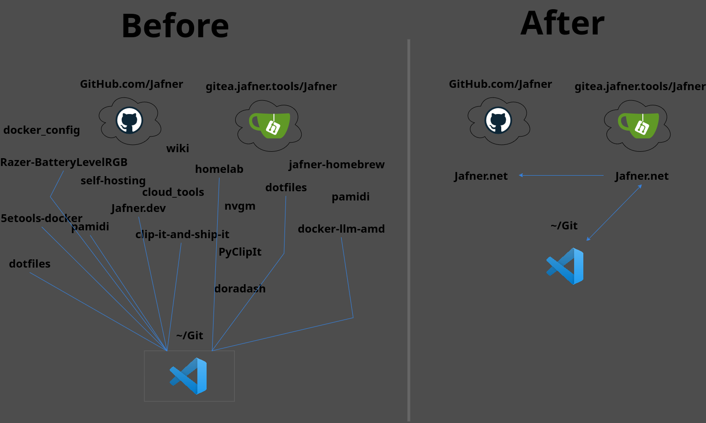
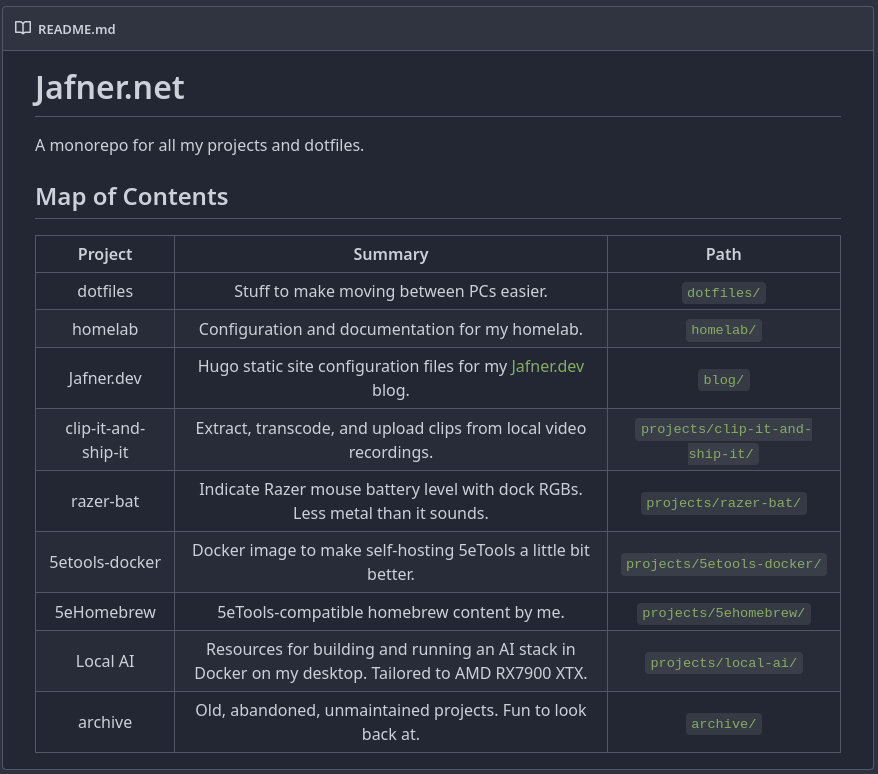

+++
title = 'Monorepo'
description = " "
date = 2024-07-17T10:23:25-07:00
aliases = []
author = "Joey Hafner"
ogimage = '/img/Jafner.dev.logo.png'
slug = "monorepo"
draft = false
+++

## How to: Pull all your Git repositories into one big monorepo

*Table of contents*
{}

### What is a monorepo?
Take all your projects across GitHub, GitLab, Gitea, and local. Plop them into one big repo. That's it.

### Why would I want one?
*An illustration of the issue*


That's more complicated. Especially for a non-traditional type of monorepo like mine. Wikipedia gives a pretty good summary on its [Monorepo](https://en.wikipedia.org/wiki/Monorepo) page, which I'll summarize briefly here:

- You can re-use code more easily.
- You can centralize management of dependencies.
- You can synchronize work-in-progress across projects very easily.
- You can refactor code across the entire organization at once.

A lot of those benefits are specific to collaborative environments where a monolithic shared version control system mitigates patterns of divergent work. But I'm just one guy writing mostly scripts and infrastructure-as-code. What do I get out of migrating to a monorepo?

- *Visibility.* A centralized body of work lets me *see everything* at once without pulling 15 repos.
- *Centralized workflow.* I'm constantly finding ways to improve my workflow. If I add a `.pre-commit-config.yaml` file to stop myself from committing secrets, I won't accidentally forget when I work in another repo.
- *Integration of infrastructure and application.* Most of my work is piles of `docker-compose.yml` files and bash scripts. But every once in a while I actually make something worth running. By keeping applications and infrastructure in the same repo, I can dramatically simplify CI/CD workflows.

## How to migrate to a monorepo
If you're reading this, you probably know what a monorepo is, and why you might want one. Let's get into the juice.

I broke down the project into **four stages**: *collect, clean, combine, and commit*. Let's dig into what each of those mean.

### Collect: Grabbing all the pieces
The first step in this project for me was to make a list of all the repos I wanted to consolidate. This included public and private repos, and only repos containing my original work.

**My list:**
Most of these have been scrubbed at this point.
1. homelab - The various iterations of my homelab configuration repos.
2. Jafner.dev - This blog!
3. dotfiles - The two copies of my dotfiles repo.
4. nvgm - An unlaunched TTRPG blog in the vein of [Angry GM](https://theangrygm.com/), or [SlyFlourish](https://slyflourish.com/).
5. pamidi - Bash script to control PulseAudio with a MIDI device.
6. docker-llm-amd - Docker AI stack optimized for my RX 7900XTX.
7. doradash - Programming practice project, meant to calculate DORA metrics from observability and CD platforms.
8. clip-it-and-ship-it - Programming practice project, meant to provide a Twitch Clips-like video highlighting experience for locally-recorded videos.
9. razer-bat - Python script to indicate Razer mouse battery level on the wireless dock's RGBs.
10. 5etools-docker - Docker image to make hosting 5eTools a *bit* better.
11. jafner-homebrew - 5eTools-compatible homebrew files for my original content.

I chose to impose upon myself two constraints for this project:

    1. Preserve git histories.
    2. Don't leak secrets.

Without those constraints, it would be as simple as pulling all the repos, running a quick `mkdir ~/Git/Monorepo && for repo in ~/Git/temp/*; do cd $repo; rm -rf .git; done && cp -rp ~/Git/temp/* ~/Git/Monorepo/ && cd ~/Git/Monorepo && git init` and boom, monorepo. Might have some secrets in the code, but those can get cleaned out before the initial commit. Quick and easy. But alas, such a solution wouldn't make a good blog post.

So, the first part is to **pull the repositories we want to consolidate**.

1. Configure the paths we want to use for the monorepo, and the temporary directory into which we'll clone the constituent repos. I used the following shell environment variables:
  - `MONOREPO_DIR=""` the path we want the monorepo to exist at. I used `~/Git/Jafner.net`.
  - `TEMP_CLONE_DIR=""` the path into which we want to clone the repos we're going to consolidate. I used `~/Git/monorepo_temp`
  - `REPOSITORIES=()` an array of tuples containing the name and URL of each repo we want to clone.
  - Our `dotfiles` and `pamidi` repositories exist as `Jafner/dotfiles` and `Jafner/pamidi` in *both* GitHub and Gitea, so we need to handle those potential collisions.
  - We're going to run a `git clone` on each of those repos, so we need to make sure we have a valid Personal Access Token or other authentication method for each repo. We only need read permissions for these repos.
2. Install `gitleaks`, `git-filter-repo`, and `bfg-repo-cleaner`. These tools facilitate cleaning secrets out of our repos.
  - [gitleaks/gitleaks](https://github.com/gitleaks/gitleaks?tab=readme-ov-file#installing)
  - [newren/git-filter-repo](https://github.com/newren/git-filter-repo/blob/main/INSTALL.md)
  - [BFG Repo-Cleaner](https://rtyley.github.io/bfg-repo-cleaner/)
3. Clone all of our repos and homologize our default branch.
  - We set all of our repos' default branch to `main`, as some of our later steps get messy if we have multiple branches.
  - I'm not sure how non-main branches are handled beyond this point. All my personal repos are single-branch.

And at this point we have all our repos together in one place. Next we need to prep each repo to be consolidated. But before that, here's the script for the steps described above in this

#### 1. Configure paths and variables
```bash
{
    echo "# 1. Configure paths and variables: started"
    echo "  # Configure local paths for Git repos. Should not contain any of the git directories involved, as all will be cloned fresh. Consider using a temporary project directory."
    MONOREPO_DIR=$HOME/Git/Jafner.net
    TEMP_CLONE_DIR=$HOME/Git/monorepo-temp
    mkdir -p "$TEMP_CLONE_DIR"
    mkdir -p "$MONOREPO_DIR"
    echo "  # Configure array of repositories to compose into monorepo."
    echo "    # Note: First repository in list is parent monorepo."
    echo "    # Note: While we don't need write access to any of the constituent repositories, we do need authenticated access for any private repositories. Use ssh URLs when possible."
    REPOSITORIES=(
      "Jafner.net ssh://git@gitea.jafner.tools:2225/Jafner/Jafner.net.git"
      "homelab ssh://git@gitea.jafner.tools:2225/Jafner/homelab.git"
      "docker_config git@github.com:Jafner/docker_config.git"
      "wiki git@github.com:Jafner/wiki.git"
      "cloud_tools git@github.com:Jafner/cloud_tools.git"
      "self-hosting git@github.com:Jafner/self-hosting.git"
      "Jafner.dev git@github.com:Jafner/Jafner.dev.git"
      "dotfiles_gitea ssh://git@gitea.jafner.tools:2225/Jafner/dotfiles.git"
      "dotfiles_github git@github.com:Jafner/dotfiles.git"
      "nvgm ssh://git@gitea.jafner.tools:2225/Jafner/nvgm.git"
      "pamidi_gitea ssh://git@gitea.jafner.tools:2225/Jafner/pamidi.git"
      "pamidi_github git@github.com:Jafner/pamidi.git"
      "docker-llm-amd ssh://git@gitea.jafner.tools:2225/Jafner/docker-llm-amd.git"
      "doradash ssh://git@gitea.jafner.tools:2225/Jafner/doradash.git"
      "clip-it-and-ship-it git@github.com:Jafner/clip-it-and-ship-it.git"
      "PyClipIt ssh://git@gitea.jafner.tools:2225/Jafner/PyClipIt.git"
      "razer-bat git@github.com:Jafner/Razer-BatteryLevelRGB.git"
      "5etools-docker git@github.com:Jafner/5etools-docker.git"
      "jafner-homebrew git@github.com:Jafner/jafner-homebrew.git"
    )
    cd $TEMP_CLONE_DIR
    echo "# 1. Configure paths and variables: completed"
}
```

#### 2. Assert dependencies are installed
```bash
{
    echo "# 2. Assert dependencies are installed: started"
    echo -n "  # gitleaks: "
    gitleaks version > /dev/null 2>&1
    GITLEAKS_MISSING=$?
    if [[ $GITLEAKS_MISSING != "0" ]]; then
        echo "missing"
        echo "    # Attempting to install from https://github.com/gitleaks/gitleaks"
        echo "    # Installing at ~/.local/bin/gitleaks"
        echo "    # Note: Building gitleaks will fail if go is not installed."
        mkdir -p ~/.local/bin
        git clone https://github.com/gitleaks/gitleaks.git /tmp/gitleaks-git
        cd /tmp/gitleaks-git
        make build
        cp gitleaks ~/.local/bin/gitleaks
    else
        echo "found at $(which gitleaks)"
    fi
    echo -n "  # git-filter-repo: "
    git filter-repo -h > /dev/null 2>&1
    FILTER_REPO_MISSING=$?
    if [[ $FILTER_REPO_MISSING != "0" ]]; then
        echo "missing"
        echo "    # git-filter repo not installed. Attempting to install from https://github.com/newren/git-filter-repo"
        echo "    # Installing at ~/.local/bin/git-filter-repo"
        mkdir -p ~/.local/bin/git-filter-repo
        curl -o ~/.local/bin/git-filter-repo https://raw.githubusercontent.com/newren/git-filter-repo/main/git-filter-repo
        chmod +x ~/.local/bin/git-filter-repo
    else
        echo "found at $(which git-filter-repo)"
    fi
    echo -n "  # BFG Repo-Cleaner: "
    bfg --version > /dev/null 2>&1
    BFG_MISSING=$?
    if [[ $BFG_MISSING != "0" ]]; then
        echo "missing"
        echo "    # Automated installation not yet implemented."
        echo "    # Install BFG Repo-Cleaner by downloading the latest jar from:"
        echo "    # https://rtyley.github.io/bfg-repo-cleaner/ "
        echo "    # Then run:"
        echo '    # sudo cp ~/Downloads/bfg.jar /usr/bin/bfg.jar && echo "java -jar /usr/bin/bfg.jar $@" | sudo tee /usr/bin/bfg && sudo chmod +x /usr/bin/bfg'
        echo "    # Exiting..."
        exit 1
    else
        echo "found at: $(which bfg)"
    fi
    echo "# 2. Assert dependencies are installed: completed"
}
```

#### 3. Clone all constituent repositories, assert default branch is main
```bash
{
    echo "# 3. Clone all constituent repositories, assert default branch is main: started"
    cd "$TEMP_CLONE_DIR"
    for repo in "${REPOSITORIES[@]:1}"; do
        REPO_NAME=$(echo $repo | cut -d' ' -f1)
        echo "  # Cloning repo $REPO_NAME"
        git clone --quiet $(echo "$repo" | cut -d' ' -f2) "$REPO_NAME" > /dev/null
        cd "$REPO_NAME"
        DEFAULT_BRANCH=$(cat .git/HEAD | cut -d' ' -f2 | xargs basename)
        if ! [[ $DEFAULT_BRANCH == "main" ]]; then
            git branch -m $DEFAULT_BRANCH main
        fi
        cd "$TEMP_CLONE_DIR"
    done
    cd $TEMP_CLONE_DIR
    echo "# 3. Clone all constituent repositories, assert default branch is main: completed"
}
```

### Clean: Scrubbing secrets from our repos and making them play nice with each other
The next stage of the process is to prepare each of our repos to be integrated into our monorepo. I took 4 steps to process my repos:

4. Rewrite each repo into a self-named subdirectory of itself.
  - We do this so that our files don't collide when we merge everything into the monorepo.
  - We use `git filter-repo --to-subdirectory-filter` to rewrite the entire history of the repo.
  - This looks like moving all of the contents of `~/Git/homelab` to `~/Git/homelab/homelab`.
  - The root of the repo doesn't move, so we still have `.git` at `~/Git/homelab/.git`.
  - If you wanted to handle this process manually, you could reorganize your repos during this step. For example, rewriting `~/Git/pamidi` to `~/Git/pamidi/projects/pamidi`.
5. Scan each repo's files *and history* for exposed secrets.
  - We use gitleaks to scrub through the full history of each repo and create a report of all findings.
  - We place the report into a subdirectory of `/tmp`, which helps mitigate the risk of accidentally keeping a list of every API key and password you've ever accidentally leaked sitting somewhere on your system.
  - You may want to add custom rules to help gitleaks find secrets matching an usual pattern. Check the [configuration documentation](https://github.com/gitleaks/gitleaks?tab=readme-ov-file#configuration) for details on how to write your own detection rules.
  - You may want to explicitly permit some secrets to remain in a repo, such as example API keys or passwords in documentation. See [gitleaks' documentation](https://github.com/gitleaks/gitleaks?tab=readme-ov-file#additional-configuration) for guidance on how to handle that situation. Just make sure to re-run this step with the new rules before proceeding to the next step.
6. Nuke secrets from git histories.
  - We generate a text file containing all the secrets listed in our gitleaks report.
  - We use BFG Repo-Cleaner's `--replace-text` flag to find and replace all historic and present instances of each secret.
  - **Warning:** this process is not perfect. Any *multi-line secrets* in the gitleaks report will be passed into BFG *one line at a time*. So if you have a multi-line secret with a *line which matches non-secrets*, BFG will nuke all matches.
  - After we're done with the secrets file, we overwrite its contents with random characters before deleting it.
7. Verify repository histories are clean.
  - We use gitleaks to scrub through the full history of each repo *again*. This time we only print information to the console and don't store a report file.
  - If any repos still contain secrets, we need to address that manually.

And after that, we've got our repos prepared to consolidate. The next steps are mostly manual and to-taste, rather than prescribed. Before that, here's the script for each of the steps above:

#### 4. Rewrite history to subdirectory for each constituent repository.
```bash
{
    echo "# 4. Rewrite history (to subdirectory) for each constituent repository: started"
    for repo in $(echo "$TEMP_CLONE_DIR"/*); do
        REPO_NAME=$(basename $repo)
        cd "$repo"
        echo "  # Rewriting repo $REPO_NAME"
        git filter-repo --quiet --to-subdirectory-filter "$REPO_NAME" --force > /dev/null
        cd "$TEMP_CLONE_DIR"
    done
    cd $TEMP_CLONE_DIR
    echo "# 4. Rewrite history (to subdirectory) for each constituent repository: completed"
}
```

#### 5. Scan each constituent repository for leaked secrets
```bash
{
    echo "# 5. Scan each constituent repository for leaked secrets: started"
    for repo in $(echo "$TEMP_CLONE_DIR"/*); do
        REPO_NAME=$(basename $repo)
        cd "$repo"
        mkdir -p /tmp/gitleaks/$REPO_NAME/
        echo -n "  # Scanning repo $REPO_NAME "
        rm -f /tmp/gitleaks/$REPO_NAME/gitleaks-report.json
        gitleaks detect -l warn --no-banner -r /tmp/gitleaks/$REPO_NAME/gitleaks-report.json && echo "No secrets detected" || COMPROMISED_REPOS+="$REPO_NAME\n"
    done
    cd $TEMP_CLONE_DIR
    echo "# 5. Scan each constituent repository for leaked secrets: completed"
}
```

#### 6. Nuke secrets from git history
```bash
{
    echo "# 6. Nuke secrets from git history: started"
    for repo in $(echo "$TEMP_CLONE_DIR"/*); do
        cd $repo
        REPO_NAME=$(basename $repo)
        report=/tmp/gitleaks/$REPO_NAME/gitleaks-report.json
        if ! [[ $(cat $report | jq length) > 0 ]]; then
            echo "  # No exposed secrets in repo $REPO_NAME; Skipping."
            continue
        fi
        echo "  # Nuking secrets in repo $REPO_NAME"
        cat $report | jq -r '.[].Secret' > /tmp/gitleaks/secret.txt
        bfg --replace-text /tmp/gitleaks/secret.txt --no-blob-protection .
        git reflog expire --expire=now --all && git gc --prune=now --aggressive
        cat /dev/urandom | tr -dc A-Za-z0-9 | head -c1000 > /tmp/gitleaks/secret.txt
        rm /tmp/gitleaks/secret.txt
    done
    cd $TEMP_CLONE_DIR
    echo "# 6. Nuke secrets from git history: completed"
}
```

#### 7. Verify repository histories are clean of secrets
```bash
{
    echo "# 7. Verify repository histories are clean of secrets: started"
    for repo in $(echo "$TEMP_CLONE_DIR"/*); do
        REPO_NAME=$(basename $repo)
        cd "$repo"
        mkdir -p /tmp/gitleaks/$REPO_NAME/
        echo -n "  # Scanning repo $REPO_NAME "
        rm -f /tmp/gitleaks/$REPO_NAME/gitleaks-report.json
        gitleaks detect -l warn --no-banner -r /tmp/gitleaks/$REPO_NAME/gitleaks-report.json && echo "No secrets detected" || echo "    # Something didn't work right; clean $REPO_NAME manually"
    done
    cd $TEMP_CLONE_DIR
    echo "# 7. Verify repository histories are clean of secrets: completed"
}
```

### Combine: Assemble the pieces and glue it together
Our third stage is the last one we can handle programmatically. Just initialize the new monorepo.

1. Initialize the new monorepo and add constituent repos.
  - It's *almost* as simple as `cp -r old-repo new-repo/old-repo`, but not quite.
  - First we run a good old-fashioned `git init`. Quick reminder to run whatever `git config --global` commands you need to ensure it initializes properly for your system.
  - Next we glomb each of our constituent repos onto the new one in four steps:
    - Add the local path to the repo as a remote.
    - Fetch the remote with tags.
    - Merge the changes on the `main` branch.
    - Then remove the remote.
  - After all that I ran one last gitleaks scan for good measure. This is entirely superstition.

#### 8. Initialize the monorepo and add constituent repos
```bash
{
    echo "# 8. Init monorepo and add constituent repos: started"
    cd "$MONOREPO_DIR"
    git init
    for repo in $(echo "$TEMP_CLONE_DIR"/*); do
        REPO_NAME=$(basename $repo)
        echo "Adding $REPO_NAME"
        git remote add "$REPO_NAME" "$repo"
        git fetch "$REPO_NAME" --tags
        git merge --quiet --allow-unrelated-histories -m "Merge $REPO_NAME into $(basename $MONOREPO_DIR)" "$REPO_NAME/main"
        git remote remove "$REPO_NAME"
    done
    echo "  # Running one more gitleaks scan for sanity."
    gitleaks detect -v --no-banner
    cd $TEMP_CLONE_DIR
    echo "# 8. Init monorepo and add constituent repos: completed"
}
```

### Commit: Reorganizing and publishing the monorepo
The last stage is to tie everything up nicely and push to the upstream.

9. Reorganize the repo to taste.
  - In my case, that meant creating the `archive`, `dotfiles`, `homelab`, `projects`, and `sites` root-level subdirectories, and sorting my other repos into those.
10. Update repo-root configuration files.
  - Files like `.gitignore`, `.gitattributes`, `.gitmodules`, *do still work in subdirectories*. But I prefer to consolidate these into one root-level file.
  - Similar stuff like `.dockerignore`, `.pre-commit-config.yaml`, and whatever your project has should be considered.
  - `.github/workflows`, `.gitea/workflows`, and `.gitlab-ci.yml` all need to be at the repo root in order to work, which will necessitate some refactoring of those jobs.
11. Write a new `README.md` for the newly-created monorepo root. In my case, I chose to populate it with a Map of Contents for the repo. It looks like this:



12. Create and add the remote origin server, and push!
  - In my case, I created the repo as private because I wasn't ready to publish it for the entire internet to scan. Once I created my private Gitea repo, I ran:
  - `git remote add origin ssh://git@gitea.jafner.tools:2225/Jafner/Jafner.net.git`
  - `git push --set-upstream origin main --force`

And that's it. Well, except for all the stuff that still needs to be done!

## Closing thoughts and next steps
At this point we probably still have some work to do before our repo is at function parity with our distributed, self-contained repos. For my repo, these are the last steps before we can mark this migration project as resolved:

- Reconfigure CI/CD pipelines to work properly with subdirectories.
- Migrate relevant issues from old repos to new repo. I have no idea how to do this, especially when repos are split across multiple platforms.
- Comb through all the cobwebbed projects we've just consolidated and archive or delete as appropriate.
- Read through [korfuri/awesome-monorepo](https://github.com/korfuri/awesome-monorepo), which is a dope page I *really* wish I'd seen before I undertook this project.

Go forth and consolidate!

## The Script
In the interest of ensuring my process was maximally reproducible (so I could wipe and restart every time I made a mistake), I wrote this script.

Steps 1, 2, and 3 are hard-coded with parameters specific to the directories and repos I'm working with. After that, everything *should be* agnostic of directories and repos.

Additionally, I wrote it such that the entire thing could be copied in chunks or in full and pasted into a terminal (zero-indent curly brackets `{}` indicate self-contained chunks). I have tested this script in both bash and zsh.

### `monorepo.sh`
```bash
#!/bin/bash

{
    echo "# 0. Quick reset: started"
    rm -rf $HOME/Git/Jafner.net
    rm -rf $HOME/Git/monorepo-temp
    rm -rf /tmp/gitleaks
    cd $HOME/Git
    echo "# 0. Quick reset: completed"
}

{
    echo "# 1. Configure paths and variables: started"
    echo "  # Configure local paths for Git repos. Should not contain any of the git directories involved, as all will be cloned fresh. Consider using a temporary project directory."
    MONOREPO_DIR=$HOME/Git/Jafner.net
    TEMP_CLONE_DIR=$HOME/Git/monorepo-temp
    mkdir -p "$TEMP_CLONE_DIR"
    mkdir -p "$MONOREPO_DIR"
    echo "  # Configure array of repositories to compose into monorepo."
    echo "    # Note: First repository in list is parent monorepo."
    echo "    # Note: While we don't need write access to any of the constituent repositories, we do need authenticated access for any private repositories. Use ssh URLs when possible."
    REPOSITORIES=(
      "Jafner.net ssh://git@gitea.jafner.tools:2225/Jafner/Jafner.net.git"
      "homelab ssh://git@gitea.jafner.tools:2225/Jafner/homelab.git"
      "docker_config git@github.com:Jafner/docker_config.git"
      "wiki git@github.com:Jafner/wiki.git"
      "cloud_tools git@github.com:Jafner/cloud_tools.git"
      "self-hosting git@github.com:Jafner/self-hosting.git"
      "Jafner.dev git@github.com:Jafner/Jafner.dev.git"
      "dotfiles_gitea ssh://git@gitea.jafner.tools:2225/Jafner/dotfiles.git"
      "dotfiles_github git@github.com:Jafner/dotfiles.git"
      "nvgm ssh://git@gitea.jafner.tools:2225/Jafner/nvgm.git"
      "pamidi_gitea ssh://git@gitea.jafner.tools:2225/Jafner/pamidi.git"
      "pamidi_github git@github.com:Jafner/pamidi.git"
      "docker-llm-amd ssh://git@gitea.jafner.tools:2225/Jafner/docker-llm-amd.git"
      "doradash ssh://git@gitea.jafner.tools:2225/Jafner/doradash.git"
      "clip-it-and-ship-it git@github.com:Jafner/clip-it-and-ship-it.git"
      "PyClipIt ssh://git@gitea.jafner.tools:2225/Jafner/PyClipIt.git"
      "razer-bat git@github.com:Jafner/Razer-BatteryLevelRGB.git"
      "5etools-docker git@github.com:Jafner/5etools-docker.git"
      "jafner-homebrew git@github.com:Jafner/jafner-homebrew.git"
    )
    cd $TEMP_CLONE_DIR
    echo "# 1. Configure paths and variables: completed"
}

{
    echo "# 2. Assert dependencies are installed: started"
    echo -n "  # gitleaks: "
    gitleaks version > /dev/null 2>&1
    GITLEAKS_MISSING=$?
    if [[ $GITLEAKS_MISSING != "0" ]]; then
        echo "missing"
        echo "    # Attempting to install from https://github.com/gitleaks/gitleaks"
        echo "    # Installing at ~/.local/bin/gitleaks"
        echo "    # Note: Building gitleaks will fail if go is not installed."
        mkdir -p ~/.local/bin
        git clone https://github.com/gitleaks/gitleaks.git /tmp/gitleaks-git
        cd /tmp/gitleaks-git
        make build
        cp gitleaks ~/.local/bin/gitleaks
    else
        echo "found at $(which gitleaks)"
    fi
    echo -n "  # git-filter-repo: "
    git filter-repo -h > /dev/null 2>&1
    FILTER_REPO_MISSING=$?
    if [[ $FILTER_REPO_MISSING != "0" ]]; then
        echo "missing"
        echo "    # git-filter repo not installed. Attempting to install from https://github.com/newren/git-filter-repo"
        echo "    # Installing at ~/.local/bin/git-filter-repo"
        mkdir -p ~/.local/bin/git-filter-repo
        curl -o ~/.local/bin/git-filter-repo https://raw.githubusercontent.com/newren/git-filter-repo/main/git-filter-repo
        chmod +x ~/.local/bin/git-filter-repo
    else
        echo "found at $(which git-filter-repo)"
    fi
    echo -n "  # BFG Repo-Cleaner: "
    bfg --version > /dev/null 2>&1
    BFG_MISSING=$?
    if [[ $BFG_MISSING != "0" ]]; then
        echo "missing"
        echo "    # Automated installation not yet implemented."
        echo "    # Install BFG Repo-Cleaner by downloading the latest jar from:"
        echo "    # https://rtyley.github.io/bfg-repo-cleaner/ "
        echo "    # Then run:"
        echo '    # sudo cp ~/Downloads/bfg.jar /usr/bin/bfg.jar && echo "java -jar /usr/bin/bfg.jar $@" | sudo tee /usr/bin/bfg && sudo chmod +x /usr/bin/bfg'
        echo "    # Exiting..."
        exit 1
    else
        echo "found at: $(which bfg)"
    fi
    echo "# 2. Assert dependencies are installed: completed"
}

{
    echo "# 3. Clone all constituent repositories, assert default branch is main: started"
    cd "$TEMP_CLONE_DIR"
    for repo in "${REPOSITORIES[@]:1}"; do
        REPO_NAME=$(echo $repo | cut -d' ' -f1)
        echo "  # Cloning repo $REPO_NAME"
        git clone --quiet $(echo "$repo" | cut -d' ' -f2) "$REPO_NAME" > /dev/null
        cd "$REPO_NAME"
        DEFAULT_BRANCH=$(cat .git/HEAD | cut -d' ' -f2 | xargs basename)
        if ! [[ $DEFAULT_BRANCH == "main" ]]; then
            git branch -m $DEFAULT_BRANCH main
        fi
        cd "$TEMP_CLONE_DIR"
    done
    cd $TEMP_CLONE_DIR
    echo "# 3. Clone all constituent repositories, assert default branch is main: completed"
}

{
    echo "# 4. Rewrite history (to subdirectory) for each constituent repository: started"
    for repo in $(echo "$TEMP_CLONE_DIR"/*); do
        REPO_NAME=$(basename $repo)
        cd "$repo"
        echo "  # Rewriting repo $REPO_NAME"
        git filter-repo --quiet --to-subdirectory-filter "$REPO_NAME" --force > /dev/null
        cd "$TEMP_CLONE_DIR"
    done
    cd $TEMP_CLONE_DIR
    echo "# 4. Rewrite history (to subdirectory) for each constituent repository: completed"
}

{
    echo "# 5. Scan each constituent repository for leaked secrets: started"
    for repo in $(echo "$TEMP_CLONE_DIR"/*); do
        REPO_NAME=$(basename $repo)
        cd "$repo"
        mkdir -p /tmp/gitleaks/$REPO_NAME/
        echo -n "  # Scanning repo $REPO_NAME "
        rm -f /tmp/gitleaks/$REPO_NAME/gitleaks-report.json
        gitleaks detect -l warn --no-banner -r /tmp/gitleaks/$REPO_NAME/gitleaks-report.json && echo "No secrets detected" || COMPROMISED_REPOS+="$REPO_NAME\n"
    done
    cd $TEMP_CLONE_DIR
    echo "# 5. Scan each constituent repository for leaked secrets: completed"
}

{
    echo "# 6. Nuke secrets from git history: started"
    for repo in $(echo "$TEMP_CLONE_DIR"/*); do
        cd $repo
        REPO_NAME=$(basename $repo)
        report=/tmp/gitleaks/$REPO_NAME/gitleaks-report.json
        if ! [[ $(cat $report | jq length) > 0 ]]; then
            echo "  # No exposed secrets in repo $REPO_NAME; Skipping."
            continue
        fi
        echo "  # Nuking secrets in repo $REPO_NAME"
        cat $report | jq -r '.[].Secret' > /tmp/gitleaks/secret.txt
        bfg --replace-text /tmp/gitleaks/secret.txt --no-blob-protection .
        git reflog expire --expire=now --all && git gc --prune=now --aggressive
        cat /dev/urandom | tr -dc A-Za-z0-9 | head -c1000 > /tmp/gitleaks/secret.txt
        rm /tmp/gitleaks/secret.txt
    done
    cd $TEMP_CLONE_DIR
    echo "# 6. Nuke secrets from git history: completed"
}

{
    echo "# 7. Verify repository histories are clean of secrets: started"
    for repo in $(echo "$TEMP_CLONE_DIR"/*); do
        REPO_NAME=$(basename $repo)
        cd "$repo"
        mkdir -p /tmp/gitleaks/$REPO_NAME/
        echo -n "  # Scanning repo $REPO_NAME "
        rm -f /tmp/gitleaks/$REPO_NAME/gitleaks-report.json
        gitleaks detect -l warn --no-banner -r /tmp/gitleaks/$REPO_NAME/gitleaks-report.json && echo "No secrets detected" || echo "    # Something didn't work right; clean $REPO_NAME manually"
    done
    cd $TEMP_CLONE_DIR
    echo "# 7. Verify repository histories are clean of secrets: completed"
}

{
    echo "# 8. Init monorepo and add constituent repos: started"
    cd "$MONOREPO_DIR"
    git init
    for repo in $(echo "$TEMP_CLONE_DIR"/*); do
        REPO_NAME=$(basename $repo)
        echo "Adding $REPO_NAME"
        git remote add "$REPO_NAME" "$repo"
        git fetch "$REPO_NAME" --tags
        git merge --quiet --allow-unrelated-histories -m "Merge $REPO_NAME into $(basename $MONOREPO_DIR)" "$REPO_NAME/main"
        git remote remove "$REPO_NAME"
    done
    echo "  # Running one more gitleaks scan for sanity."
    gitleaks detect -v --no-banner
    cd $TEMP_CLONE_DIR
    echo "# 8. Init monorepo and add constituent repos: completed"
}

{
    echo "############################################################"
    echo "#                                                          #"
    echo "# Next steps:                                              #"
    echo "# 1. Reorganize the repo to taste                          #"
    echo "# 2. Update repo-root configuration files such as:         #"
    echo "#    - .gitignore, .gitattributes, .gitmodules             #"
    echo "#    - .dockerignore, .pre-commit-config.yaml              #"
    echo "#    - .github/workflows, .gitlab-ci.yml, .gitea/workflows #"
    echo "#    - LICENSE, CONTRIBUTING, MAINTAINERS                  #"
    echo "# 3. Write a new root-level README.md                      #"
    echo "# 4. Add the remote repo as origin with:                   #"
    echo "#      git remote add origin <ssh URL of repo>             #"
    echo "# 5. Push the code to the Git server with:                 #"
    echo "#      git push --set-upstream origin main                 #"
    echo "#                                                          #"
    echo "############################################################"
}
```
